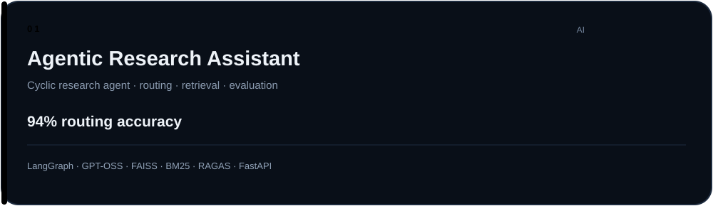
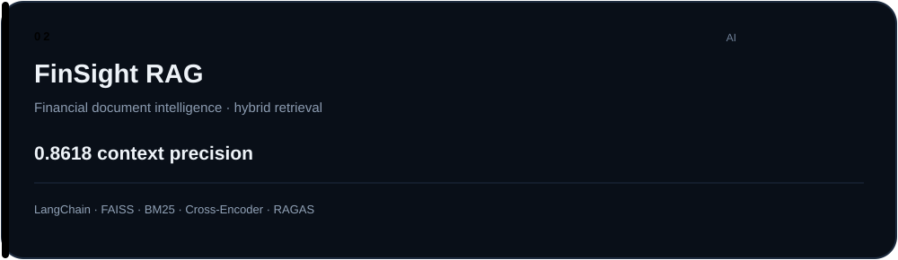
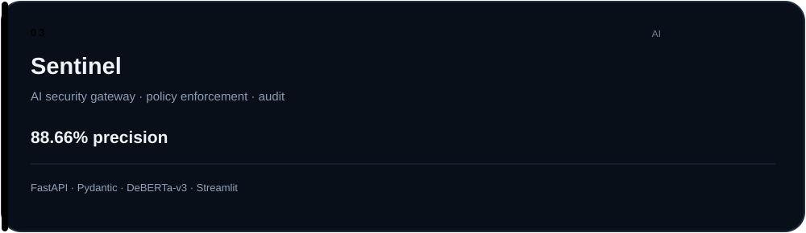
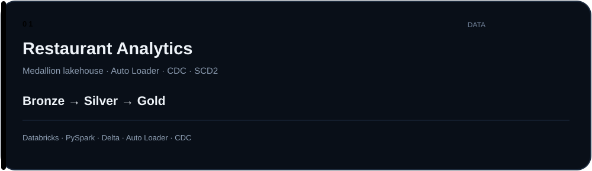
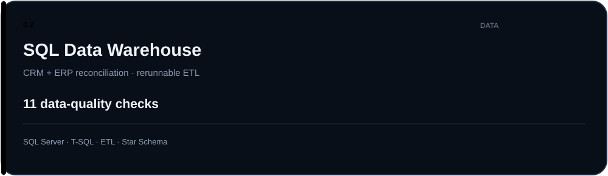
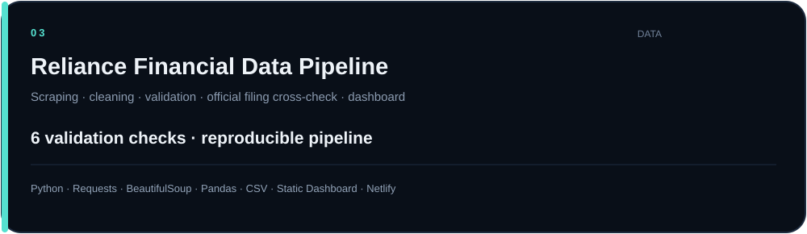
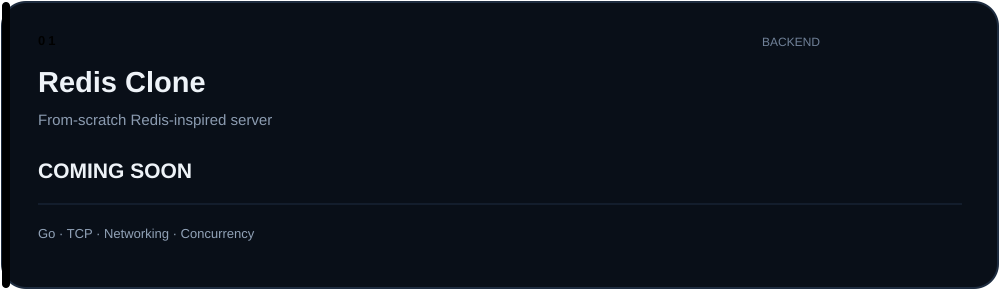
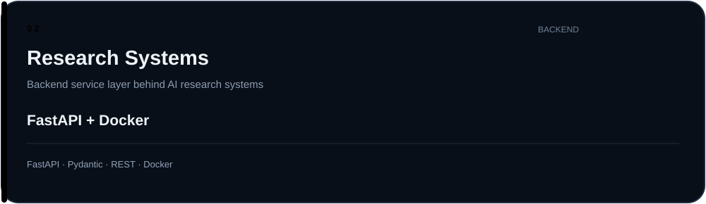

 

&nbsp;

&nbsp;

&nbsp;

  

---

# I'M CERTIFIED

<table>
<tr>
<td align="center" width="33%"><b>AWS Certified AI Practitioner</b></td>
<td align="center" width="33%"><b>AWS Certified Cloud Practitioner</b></td>
<td align="center" width="33%"><b>AWS Cloud Quest</b></td>
</tr>
</table>

---

# I HAVE A PUBLISHED PAPER

### [SachAI — Hybrid Deep Learning for Deepfake Detection](https://ieeexplore.ieee.org/abstract/document/11608562)

---

# 🤖 AI ENGINEERING

> Agents · Retrieval · Evaluation · Security

 

 

 

**AI TOOLBOX**

`PyTorch` · `Transformers` · `LangChain` · `LangGraph` · `FAISS` · `BM25` · `Cross-Encoder` · `RAGAS` · `LangSmith` · `Guardrails`

---

# ◈ DATA ENGINEERING

> Lakehouse · ETL · SQL · Analytics

 

 

 

**DATA TOOLBOX**

`PySpark` · `Databricks` · `Delta Lake` · `SQL` · `T-SQL` · `ETL` · `CDC` · `SCD1` · `SCD2`

---

# ⚙ BACKEND ENGINEERING

> APIs · Services · Go · Infrastructure

 

 

**BACKEND TOOLBOX**

`Python` · `FastAPI` · `Pydantic` · `REST APIs` · `Docker` · `Linux` · `Go (WIP)`

---

<a href="#top">↑ back to top</a>

