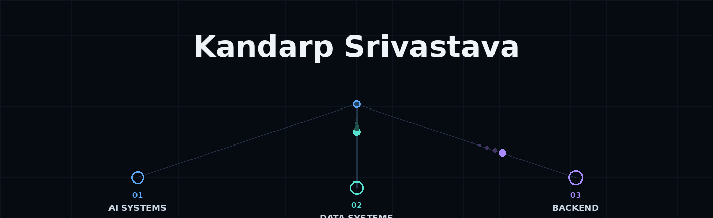
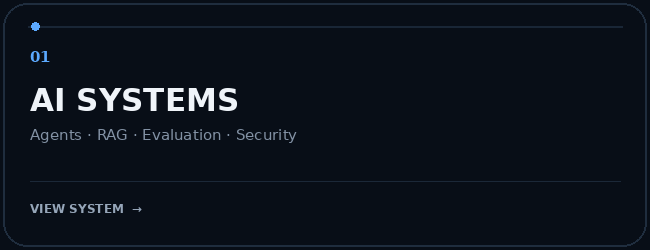
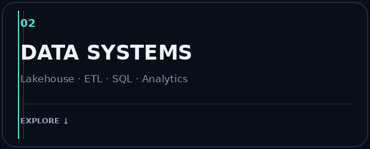
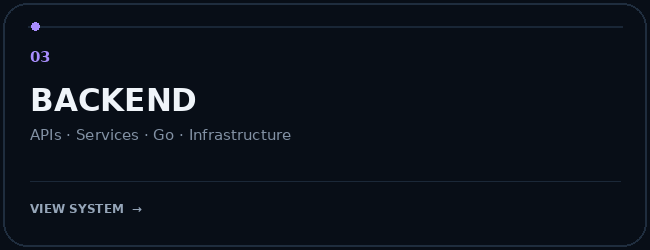
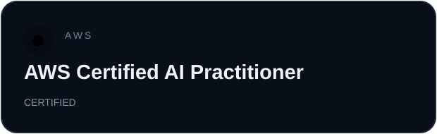
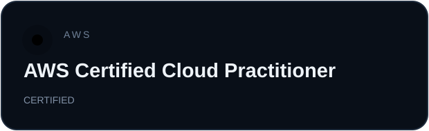
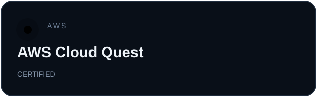
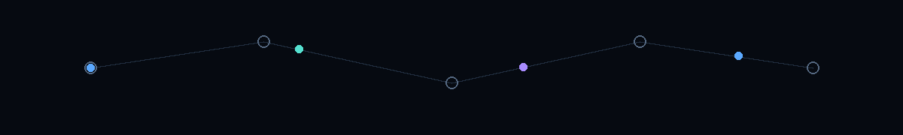

 

&nbsp;

&nbsp;

&nbsp;

  

---

## I'M CERTIFIED

- **AWS Certified AI Practitioner**
- **AWS Certified Cloud Practitioner**
- **AWS Cloud Quest**

---

## I HAVE A PUBLISHED PAPER

### [SachAI — Hybrid Deep Learning for Deepfake Detection](https://ieeexplore.ieee.org/abstract/document/11608562)

*IEEE ICITSIF 2026 · 93.5% F1*

---

# 🤖 AI ENGINEERING

> Building agents and grounded LLM systems with retrieval, evaluation, guardrails and security.

### Agentic Research Assistant

A cyclic LangGraph research agent that routes queries across retrieval, web search, calculation and direct answering, then evaluates its own result.

**94% routing accuracy** · **0.9091 context precision** · **5,500+ chunks**

`LangGraph` `GPT-OSS` `FAISS` `BM25` `Cross-Encoder` `RAGAS` `FastAPI` `Docker`

→ [Repository](https://github.com/kforkandarp/agentic-research-assistant)

### FinSight RAG

Financial document intelligence over Infosys annual reports using hybrid retrieval, reranking, citation enforcement and grounded refusal.

**0.8618 context precision** · **0.7020 faithfulness**

`LangChain` `FAISS` `BM25` `Cross-Encoder` `RAGAS` `FastAPI` `Docker`

→ [Repository](https://github.com/kforkandarp/finsight-rag)

### Sentinel

AI security gateway for agentic commerce with detection, provenance, policy enforcement, execution controls and audit logging.

**88.66% precision** · **81.25% accuracy** · **71.67% recall**

`FastAPI` `Pydantic` `DeBERTa-v3` `Streamlit` `Docker`

→ [Repository](https://github.com/kforkandarp/sentinel)

**AI TOOLBOX**

`PyTorch` · `Transformers` · `LangChain` · `LangGraph` · `FAISS` · `BM25` · `Cross-Encoder` · `RAGAS` · `LangSmith` · `Guardrails`

---

# ◈ DATA ENGINEERING

> Building pipelines that move from raw data to reliable analytical systems.

### Restaurant Analytics — Databricks

End-to-end medallion lakehouse with incremental ingestion, AUTO CDC, SCD1/SCD2, LLM review enrichment, quality expectations, gold models, dashboards and workflow orchestration.

`Databricks` `PySpark` `Delta Lake` `Auto Loader` `CDC` `SCD2` `SQL` `Python` `Groq`

→ [Repository](https://github.com/kforkandarp/restaurant-analytics-databricks)

### SQL Data Warehouse

End-to-end T-SQL warehouse transforming CRM + ERP sources into a reconciled star schema with rerunnable ETL and validation.

**11 data-quality checks** · **CRM/ERP reconciliation** · **Bronze → Silver → Gold**

`SQL Server` `T-SQL` `ETL` `Stored Procedures` `Star Schema`

→ [Repository](https://github.com/kforkandarp/sql-data-warehouse-project)

### Reliance Analytics

*Project slot reserved for the Reliance Analytics work.*

> Add the verified repository/details here once the project information is available.

**DATA TOOLBOX**

`PySpark` · `Databricks` · `Delta Lake` · `SQL` · `T-SQL` · `ETL` · `CDC` · `SCD1` · `SCD2`

---

# ⚙ BACKEND ENGINEERING

> APIs, service layers and the foundations underneath larger systems.

### Redis Clone — Go

🚧 **COMING SOON**

A from-scratch Redis-inspired server in Go.

`Go` · `TCP` · `Networking` · `Concurrency` · `In-Memory Storage`

### Research / Systems

Backend engineering demonstrated through the service layers behind the research and AI systems above.

`FastAPI` · `Pydantic` · `REST APIs` · `Docker` · `Structured Outputs` · `Error Handling`

→ [Agentic Research Assistant](https://github.com/kforkandarp/agentic-research-assistant) · [FinSight RAG](https://github.com/kforkandarp/finsight-rag) · [Sentinel](https://github.com/kforkandarp/sentinel)

---

  

**BUILD · MEASURE · LEARN · REPEAT**

