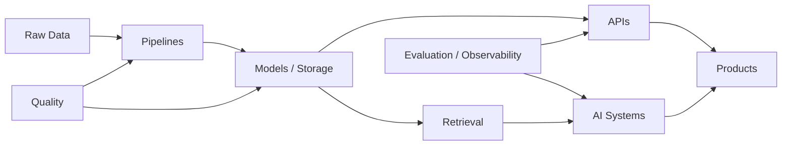

<div align="center">


# Kandarp Srivastava

### Software Engineer


<br>

> *I like building things that turn messy data and rough ideas into working systems.*  
> *Usually that means playing around with AI, pipelines, APIs, retrieval, and a slightly unhealthy amount of debugging.*

<!-- <br>


<br><br> -->

<a href="mailto:kandarpsri@gmail.com"></a>
<a href="https://www.linkedin.com/in/kandarp-srivastava-227345159/"></a>
<a href="https://github.com/kforkandarp"></a>
<a href="https://leetcode.com/u/KtheKandarp/"></a>

<br><br>


</div>

## `$ whoami`

```text
Software Engineer
├── backend systems
├── data platforms
└── applied AI
```

Most of the work I enjoy sits somewhere between **backend, data, and AI**.

I like building the practical parts of software too — the ingestion jobs, the validation checks, the APIs, the retrieval layer, the evaluation setup, and the “why is this breaking only in production?” phase that comes with all of it.

---

## `01 // WHAT I BUILD`

<table>
<tr>
<td width="33%" valign="top">

### ⚙️ Backend Systems

`Python` `FastAPI` `REST APIs`

I enjoy building service layers, APIs, and containerized applications that are easy to reason about and reliable to run.

</td>
<td width="33%" valign="top">

### ◫ Data Platforms

`Databricks` `PySpark` `SQL`

I work on ETL / ELT pipelines, lakehouse flows, CDC, SCD, data quality, and dimensional modeling.

</td>
<td width="33%" valign="top">

### ✦ Applied AI

`RAG` `Agents` `Evaluation`

I build retrieval systems, agentic workflows, LLM applications, evaluation loops, and AI guardrails.

</td>
</tr>
</table>

---

## `02 // FEATURED PROJECTS`

<table>
<tr>
<td width="50%" valign="top">

### 🤖 Agentic Research Assistant

`LangGraph` `GPT-OSS` `RAGAS` `FastAPI` `Docker`

Agentic research system with cyclic tool routing and autonomous evidence evaluation.

**94% routing accuracy**  
**0.91 context precision**

→ [Explore project](https://github.com/kforkandarp/agentic-research-assistant)

</td>
<td width="50%" valign="top">

### 📊 Restaurant Analytics Platform

`Databricks` `PySpark` `Delta Lake` `Auto Loader`

End-to-end medallion lakehouse with incremental ingestion, CDC, SCD Type 1/2, orchestration, and analytics.

**8,000+ historical orders**  
**30+ data-quality rules**

→ [Explore project](https://github.com/kforkandarp/restaurant-analytics-databricks)

</td>
</tr>

<tr>
<td width="50%" valign="top">

### 🔎 FinSight RAG

`LangChain` `FAISS` `BM25` `Cross-Encoder`

Financial-document intelligence system using hybrid retrieval, reranking, and citation-grounded responses.

**0.86 context precision**  
Hybrid BM25 + vector retrieval

→ [Explore project](https://github.com/kforkandarp/finsight-rag)

</td>
<td width="50%" valign="top">

### 📈 Financial Data Pipeline

`Python` `Pandas` `BeautifulSoup` `pdfplumber`

Reproducible financial ETL pipeline with validation, raw-data preservation, PDF parsing, and reconciliation.

**6 automated validation checks**  
Official-filing cross-validation

→ [Explore project](https://github.com/kforkandarp/financial-data-pipeline)

</td>
</tr>

<tr>
<td width="50%" valign="top">

### 🛡️ Sentinel

`FastAPI` `Pydantic` `DeBERTa-v3` `Docker`

Security gateway that separates prompt-injection detection from deterministic authorization.

**240-example benchmark**  
**96 automated tests**

→ [Explore project](https://github.com/kforkandarp/sentinel)

</td>
<td width="50%" valign="top">

### 🗄️ SQL Data Warehouse

`SQL Server` `T-SQL` `ETL` `Star Schema`

Bronze → Silver → Gold warehouse integrating CRM and ERP sources with reusable cleansing and dimensional modeling.

**14 automated quality checks**  
Fact / dimension architecture

→ [Explore project](https://github.com/kforkandarp/sql-data-warehouse-project)

</td>
</tr>
</table>

---

## `03 // TOOLKIT`

<div align="center">


<br><br>


<br>


</div>

---

## `04 // ENGINEERING THROUGH-LINE`



<div align="center">

**Data gives systems context. Backend gives them structure. AI adds new capabilities.**

</div>

---

## `05 // RESEARCH + CREDENTIALS`

<table>
<tr>
<td valign="top">

### 🧠 SachAI — Deep Fake Video Detection

**IEEE · ICITSIF 2026**

Worked on a deepfake-detection system using **ResNeXt-50 + LSTM** to capture spatial and temporal video features, reaching **93.5% F1** on benchmark datasets including Celeb-DF v1.

<br>

### ☁️ AWS Credentials


&nbsp;

&nbsp;


</td>
</tr>
</table>

<div align="center">

<sub>🤖 AI did the first pass. Now comes the engineering review.</sub>

</div>

---

<div align="center">


<br>


</div>
